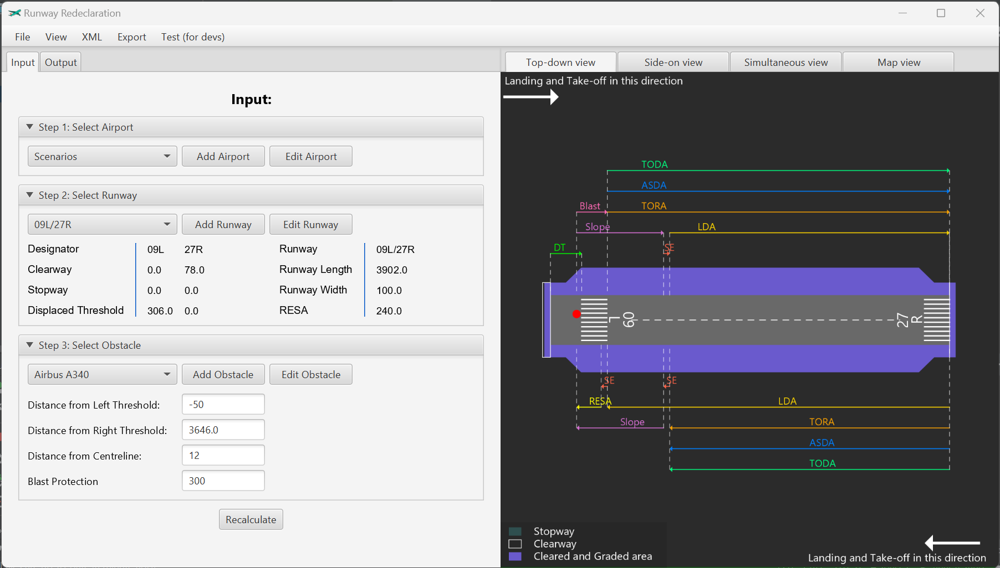

# SEG Runway-Redeclaration Project

This is our Software Engineering Group Project (COMP2211).

## Task

The customer desires a tool which, given standard runway information and information about an
obstacle, provides the revised runway parameters together with a visualisation of the obstacle and a
summary of the calculations. The tool will be used to obtain a rapid indication of the effect of an
obstruction on the runway parameters as an aid to deciding whether operations can continue, and
whether performing the calculations in accord with the official process is worthwhile. The tool will
be used as an aid/guide. It cannot replace the official process.

## Features

- Top-down, side-on, simultaneous and map views to visualise the runway.
- Re-calculate a runway given an obstacle.
- Pre-defined obstacles.
- Calculation breakdown.
- Import/export XML.
- Rotate runway strip to match compass heading.
- Select airports, runways and obstacles.

# Demo

